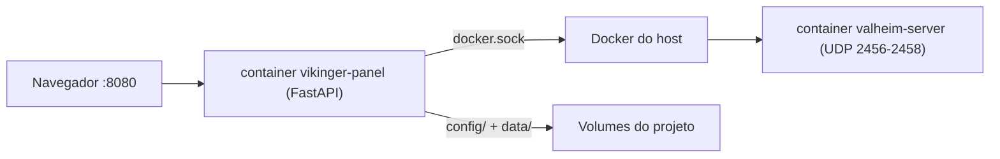

# Vikinger Panel

Painel web moderno para gerenciar servidores **Valheim** dockerizados — mundos, mods BepInEx,
backups, métricas, logs e muito mais, tudo em uma interface única.

[](LICENSE)
[](https://github.com/viniciuspetrachin/vikinger-panel)

> Interface em português · 100% dockerizado · Testes unitários e E2E · Sem CDN externo

---

## Monorepo: uma pasta, dois containers

Todo o projeto vive em **uma única pasta**. O `docker compose` sobe **dois containers separados**:



```
vikinger-panel/
├─ panel/                     # painel web (FastAPI + Alpine.js) — todo o código-fonte
├─ server/                    # infra do servidor de jogo (compose standalone)
├─ scripts/                   # dev.sh, reload-panel.sh, entrypoint.sh, install-mods.sh
├─ docker-compose.yml         # PRODUÇÃO: sobe valheim-server + vikinger-panel
├─ docker-compose.dev.yml     # DEV: hot-reload sem rebuild
├─ config/                    # config do servidor (gitignored)
├─ data/                      # dados do jogo: mundos, steamapps (gitignored)
└─ panel-data/                # dados do painel: auditoria, registry de mods (gitignored)
```

---

## Funcionalidades

| Área | O que você pode fazer |
|------|----------------------|
| **Visão Geral** | Status do servidor, jogadores online, console ao vivo, controles rápidos |
| **Servidor** | Nome, senha, porta, listas admin/ban/permitidos, argumentos extra (`-crossplay`) |
| **Mundos** | Criar, trocar, presets (Fácil → Hardcore), editor de `.fwl`, importar mundos |
| **Mods e Configs** | Instalar via Thunderstore/URL/upload, ativar/desativar, editar `.cfg` BepInEx, atualizações do jogo e por mod |
| **Backups** | Agendamento cron, backup manual, download e restauração |
| **Recursos** *(avançado)* | Limite de RAM do container, gráficos de CPU/rede em tempo real |
| **Arquivos** *(avançado)* | Navegador de arquivos com editor CodeMirror |
| **Logs / Auditoria** *(avançado)* | Logs do Docker sanitizados, trilha de auditoria de todas as ações |

O **Modo avançado** na sidebar revela Recursos, Arquivos, Logs e Auditoria — ideal para
administradores experientes.

---

## Requisitos

- Linux com **Docker** e **Docker Compose** v2
- Portas UDP **2456–2458** liberadas (para jogadores externos)
- ~4 GB RAM recomendados (Valheim + BepInEx + painel)
- Acesso ao `docker.sock` (o container do painel controla o servidor)

---

## Instalação rápida

```bash
git clone https://github.com/viniciuspetrachin/vikinger-panel.git
cd vikinger-panel
cp .env.example .env
# Edite .env: SERVER_NAME, WORLD_NAME, SERVER_PASS, HOST_PROJECT_DIR, DOCKER_GID
docker compose up -d --build
```

Abra **http://localhost:8080** (ou a porta definida em `PANEL_PORT`).

### Instalação sem código-fonte (usuário final)

Para quem só quer rodar o servidor, sem clonar o repositório, baixe o pacote ZIP em
**[GitHub Releases](https://github.com/viniciuspetrachin/vikinger-panel/releases)**.
O pacote inclui a imagem Docker pré-construída e um guia passo a passo (`README-INSTALL.md`).

---

## CI/CD e releases

Cada merge na branch `main` dispara automaticamente:

1. **Testes** (unitários + E2E com Playwright)
2. **Versionamento** — incremento automático do patch (`2.1.0` → `2.1.1`; major/minor só mudam se você editar manualmente em `panel/version.py`)
3. **Git tag** `vX.Y.Z` e **GitHub Release** com:
   - ZIP pronto para leigos (sem código-fonte)
   - Arquivo `.tar` da imagem Docker
4. **Imagem no GHCR:** `ghcr.io/viniciuspetrachin/vikinger-panel:X.Y.Z`

Pull requests para `main` rodam os mesmos testes via GitHub Actions. Configure **branch protection**
no repositório para exigir o check `test` antes do merge — veja [CONTRIBUTING.md](CONTRIBUTING.md).

---

### Variáveis importantes

| Variável | Descrição |
|----------|-----------|
| `SERVER_NAME` | Nome exibido na lista do Valheim |
| `WORLD_NAME` | Mundo ativo na primeira subida |
| `SERVER_PASS` | Senha do servidor (mín. 5 caracteres) |
| `HOST_PROJECT_DIR` | Caminho absoluto do projeto no host |
| `DOCKER_GID` | GID do grupo `docker` no host (`getent group docker`) |
| `PANEL_PORT` | Porta HTTP do painel (padrão `8080`) |
| `UPDATE_CRON` | Cron de verificação de updates do jogo (vazio = desligado) |
| `UPDATE_IF_IDLE` | Só atualizar quando não houver jogadores (`true`/`false`) |

Na aba **Mods**, configure auto-atualização do jogo, modo vanilla/modded (BepInEx) e updates individuais de mods Thunderstore.

### Primeira subida

Na primeira execução o container do Valheim baixa o jogo e instala o BepInEx — pode levar
vários minutos. Acompanhe na aba **Visão Geral** (console ao vivo).

### Rodar só o servidor (sem painel)

```bash
docker compose --project-directory . -f server/docker-compose.standalone.yml up -d
```

---

## Desenvolvimento

### Modo dev com hot-reload (recomendado para debug)

```bash
./scripts/dev.sh
```

- **Backend:** `uvicorn --reload` — editar `panel/*.py` recarrega sozinho.
- **Frontend:** watcher Tailwind + esbuild — editar `panel/frontend/**` regenera os bundles.
- Basta **F5** no navegador; **não precisa rebuild** da imagem.

Sob o capô, `docker-compose.dev.yml` monta `panel/` por cima de `/app` e sobe um container
`assets` (Node) rodando o watcher.

### Deploy de produção (imagem embarcada)

Fora do modo dev, o painel serve arquivos **embarcados na imagem**. Após alterar código:

```bash
./scripts/reload-panel.sh           # rebuild + restart do container
./scripts/reload-panel.sh --tests   # pytest unit + e2e antes, depois deploy
```

### Testes e build manual

```bash
cd panel
python -m venv .venv && .venv/bin/pip install -r requirements.txt
.venv/bin/pytest tests/unit -q          # unitários
.venv/bin/playwright install chromium
.venv/bin/pytest tests/e2e -q           # E2E com Playwright

npm install && npm run build            # rebuild CSS/JS
```

Veja [CONTRIBUTING.md](CONTRIBUTING.md) para o fluxo completo de contribuição.

---

## Stack

FastAPI · Alpine.js · Tailwind CSS · Chart.js · CodeMirror · Docker Compose

---

## Licenciamento

Este projeto usa a **[Polyform Shield 1.0.0](LICENSE)** — licença *source-available* pensada
para projetos que querem comunidade aberta **sem permitir revenda**.

### Uso gratuito para quem auto-hospeda

- Rodar no **seu próprio** servidor Valheim (casa, VPS, comunidade)
- Modificar o código para uso pessoal
- Contribuir com PRs, issues e documentação
- Distribuir forks mantendo os termos da licença

### Licença paga para empresas de hospedagem

- Provedores de **hospedagem** que oferecem o painel aos clientes
- **Revenda** ou white-label como produto pago
- Qualquer serviço que concorra com o Vikinger Panel como oferta comercial

Detalhes, planos e contato: **[COMMERCIAL-LICENSE.md](COMMERCIAL-LICENSE.md)**

---

## Doações

O desenvolvimento é mantido de forma independente. Se o painel te ajuda, considere apoiar
pela aba **Doações** dentro do painel. Configure os links no `.env`:

```bash
PANEL_DONATION_GITHUB=https://github.com/sponsors/seu-usuario
PANEL_DONATION_KOFI=https://ko-fi.com/seu-usuario
PANEL_DONATION_PIX=sua-chave-pix@email.com
PANEL_COMMERCIAL_EMAIL=licensing@seudominio.com
```

> Doações são voluntárias e **não substituem** licença comercial para hospedagens.

---

## Créditos

- [lloesche/valheim-server-docker](https://github.com/lloesche/valheim-server-docker) — imagem base do servidor
- [Thunderstore Valheim](https://thunderstore.io/c/valheim/) — mods
- Comunidade Valheim BR

---

## Suporte

- **Bugs e features:** [GitHub Issues](https://github.com/viniciuspetrachin/vikinger-panel/issues)
- **Licenciamento comercial:** veja [COMMERCIAL-LICENSE.md](COMMERCIAL-LICENSE.md)
- **Ajuda no painel:** aba **Ajuda** (FAQ integrado)

---

© 2026 [Vinicius Petrachin](https://github.com/viniciuspetrachin) ·
[Polyform Shield 1.0.0](LICENSE)
